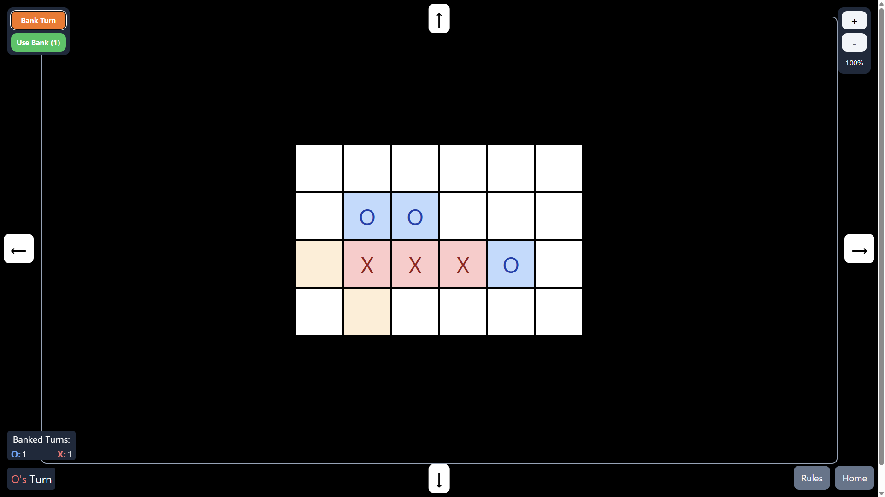

# Infinite Noughts and Crosses (updated)

Updated version of the [custom Noughts and Crosses game](https://github.com/william-spongberg/inf-noughts-and-crosses) I created to make Noughts and Crosses more strategic and fun. Created using Deno and Fresh.

## Rules

- The game board can now be infinitely extended! You can sacrifice a turn to extend the board by a row or column in any direction.
- You need 4 in a row to win, instead of 3.
- Every play must be vertically or horizontally adjacent to the last one.
- If you cannot play a piece, you lose.
- You can choose to bank a turn and use it later.

